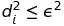
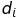

# DBSCAN in Scala

[DBSCAN](https://en.wikipedia.org/wiki/DBSCAN) implementation in Scala using [Esri Geometry API](https://github.com/Esri/geometry-api-java).

[](https://bintray.com/mraad/maven/dbscan-scala/_latestVersion)

### Comparing to Commons Math

Wanted to make sure my implementation was "correct", so I compared it with [Commons Math](https://commons.apache.org/proper/commons-math/).
But kept getting different cluster counts! When I looked at the source code (Gotta love OSS :-) I found a small discrepancy in the calculation of the number of neighbors.
Per Wikipedia's pseudocode implementation (because everything you read on the internet is correct :-) the `regionQuery` should include the center point, as we are calculating the number of points forming a cluster.

IMHO, the code in the `DBSCANClusterer` should be:

```
if (distance(neighbor, point) <= eps) {
```

rather than:

```
if (point != neighbor && distance(neighbor, point) <= eps) {
```

And the test code still passes!

### Boundary Conditions

The concept of neighborhood is implemented as , where  is the euclidean distance between two points.

## Publish to [Bintray](https://bintray.com/mraad/maven/dbscan-scala/view)

```bash
mvn release:clean
mvn release:prepare
mvn release:perform
```

## Using the project as dependency

```xml
<repositories>
    <repository>
        <id>bintray</id>
        <url>http://dl.bintray.com/mraad/maven</url>
        <releases>
            <enabled>true</enabled>
        </releases>
        <snapshots>
            <enabled>false</enabled>
        </snapshots>
    </repository>
</repositories>
```

```xml
<dependency>
    <groupId>com.esri</groupId>
    <artifactId>dbscan-scala</artifactId>
    <version>0.11</version>
</dependency>
```

### References

* <http://people.cs.nctu.edu.tw/~rsliang/dbscan/testdatagen.html>
* <https://help.github.com/articles/generating-ssh-keys/>
* <http://veithen.github.io/2013/05/26/github-bintray-maven-release-plugin.html>
* <http://www.sciweavers.org/free-online-latex-equation-editor>
* <http://blog.dominodatalab.com/topology-and-density-based-clustering/>
* <https://en.wikipedia.org/wiki/OPTICS_algorithm>
* <http://www.naftaliharris.com/blog/visualizing-dbscan-clustering/>
